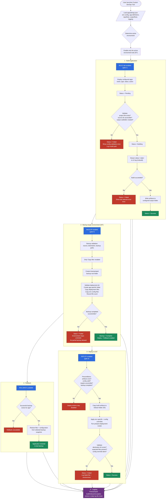

# DevOpsTool - Deployment Flow

Flowchart based on the **BUILD**, **SIT**, **CAT**, and **PROD** screens in the Custom DevOps
Deployment Tool (.NET MAUI Blazor Hybrid app).

```mermaid
flowchart TD
    Start([Launch DevOps Tool]) --> BuildTab[BUILD tab]

    subgraph BUILD["BUILD"]
        direction TB
        Config["Configure paths<br/>Code Repo Root,<br/>Output Root, Build Backup folder"]
        Config --> PullLatest["Pull latest changes<br/>from Code repo"]
        PullLatest --> BuildBackup["Backup previous successful<br/>build files<br/>to Build Backup folder"]
        BuildBackup --> AppList["Display applications<br/>name, type, status, action"]
        AppList --> BuildChoice{Choose action}
        BuildChoice --> BuildOne[Build selected app]
        BuildChoice --> BuildAll[Build All]
        BuildChoice --> DbRollupBtn[Bundle DB Scripts]

        BuildOne --> Msbuild["Run msbuild<br/>Configuration=Release, DeployOnBuild=true"]
        BuildAll --> Msbuild

        DbRollupBtn --> DbSource["Choose script source folder<br/>e.g. D:\\db-rollup-scripts"]
        DbSource --> DbConfig["Read build.dbScriptSource<br/>from appsettings.json"]
        DbConfig --> DbBuilder["Run DBRollupScriptBuilder.exe<br/>generate combined script file"]
        DbBuilder --> DbCopy["Copy scripts to<br/>{outputRoot}\\db-scripts\\"]

        Msbuild --> BuildLog[Stream progress to Output Log<br/>live UI + log text file]
        DbCopy --> BuildLog
        BuildLog --> BuildOk{Build succeeded?}
        BuildOk -- Yes --> Output["Artifacts written to<br/>Output Root folder<br/>(code + db-scripts)"]
    end

    BuildTab --> Config
    Output --> SitTab[SIT tab]
    BuildOk -- No --> BuildFail([Build failed])

    subgraph SIT["SIT environment"]
        direction TB
        SitTab --> SitBackupRequired["Backup required<br/>deployment actions locked until complete"]
        SitBackupRequired --> SitRunBackup["Run backup<br/>timestamped backup folder"]
        SitRunBackup --> SitAppType{Application type?}

        SitAppType --> SitWebApi["Web / API / MVC / ASMX"]
        SitAppType --> SitWinSvc["Windows Service / MSI"]

        SitWebApi --> SitStopPool[Stop App Pool]
        SitStopPool --> SitCopyFiles["Copy Files<br/>build output to IIS folder"]
        SitCopyFiles --> SitConfigOverride["Apply config override<br/>e.g. web.config"]
        SitConfigOverride --> SitReadyWeb[Status = Ready]

        SitWinSvc --> SitInstallMsi[Install MSI]
        SitInstallMsi --> SitConfirmMsi[Confirm install]
        SitConfirmMsi --> SitCopyConfig[Copy Config]
        SitCopyConfig --> SitReadySvc[Status = Ready]

        SitCopyFiles --> SitDbGate["DB actions available<br/>after backup and file copy complete"]
        SitDbGate --> SitBackupDb[Backup DB]
        SitBackupDb --> SitApplySchema[Apply Schema Scripts]
        SitApplySchema --> SitDbReady[DB scripts deployed]

        SitReadyWeb --> SitDeployLog[Write Deployment Log]
        SitReadySvc --> SitDeployLog
        SitDbReady --> SitDeployLog
        SitReadyWeb -. optional .-> SitRollback[Rollback]
    end

    SitDeployLog --> CatTab[CAT tab]

    subgraph CAT["CAT environment"]
        direction TB
        CatTab --> CatBackupRequired["Backup required<br/>deployment actions locked until complete"]
        CatBackupRequired --> CatRunBackup["Run backup<br/>timestamped backup folder"]
        CatRunBackup --> CatAppType{Application type?}

        CatAppType --> CatWebApi["Web / API / MVC / ASMX"]
        CatAppType --> CatWinSvc["Windows Service / MSI"]

        CatWebApi --> CatStopPool[Stop App Pool]
        CatStopPool --> CatCopyFiles["Copy Files<br/>build output to IIS folder"]
        CatCopyFiles --> CatConfigOverride["Apply config override<br/>e.g. web.config"]
        CatConfigOverride --> CatReadyWeb[Status = Ready]

        CatWinSvc --> CatInstallMsi[Install MSI]
        CatInstallMsi --> CatConfirmMsi[Confirm install]
        CatConfirmMsi --> CatCopyConfig[Copy Config]
        CatCopyConfig --> CatReadySvc[Status = Ready]

        CatCopyFiles --> CatDbGate["DB actions available<br/>after backup and file copy complete<br/>e.g. CAT-SQL-01 / GSSDB"]
        CatDbGate --> CatBackupDb[Backup DB]
        CatBackupDb --> CatApplySchema[Apply Schema Scripts]
        CatApplySchema --> CatDbReady[DB scripts deployed]

        CatReadyWeb --> CatDeployLog[Write Deployment Log]
        CatReadySvc --> CatDeployLog
        CatDbReady --> CatDeployLog
        CatReadyWeb -. optional .-> CatRollback[Rollback]
    end

    CatDeployLog --> ProdTab[PROD tab]

    subgraph PROD["PROD environment"]
        direction TB
        ProdTab --> ProdServerSelect["Select target server<br/>e.g. PROD-WEB-01"]
        ProdServerSelect --> ProdBackup["Run backup"]
        ProdBackup --> ProdDrain["Load balancer draining<br/>health.gif to health.dat<br/>remove server from pool"]
        ProdDrain --> ProdDrainWait{Active connections = 0?}
        ProdDrainWait -- No --> ProdDrain
        ProdDrainWait -- Yes --> ProdAppType{Application type?}

        ProdAppType --> ProdWebApi["Web / API / MVC / ASMX"]
        ProdAppType --> ProdWinSvc["Windows Service / MSI"]

        ProdWebApi --> ProdStopPool[Stop App Pool]
        ProdStopPool --> ProdCopyFiles["Copy Files<br/>build output to IIS folder"]
        ProdCopyFiles --> ProdConfigOverride["Apply config override"]
        ProdConfigOverride --> ProdReadyWeb[Status = Ready]

        ProdWinSvc --> ProdInstallMsi[Install MSI]
        ProdInstallMsi --> ProdConfirmMsi[Confirm install]
        ProdConfirmMsi --> ProdCopyConfig[Copy Config]
        ProdCopyConfig --> ProdReadySvc[Status = Ready]

        ProdCopyFiles --> ProdDbGate["DB actions available<br/>after backup and file copy complete"]
        ProdDbGate --> ProdBackupDb[Backup DB]
        ProdBackupDb --> ProdApplySchema[Apply Schema Scripts]
        ProdApplySchema --> ProdDbReady[DB scripts deployed]

        ProdReadyWeb --> ProdReturnLb["Return to load balancer<br/>restore health endpoint"]
        ProdReadySvc --> ProdReturnLb
        ProdDbReady --> ProdReturnLb
        ProdReturnLb --> ProdDeployLog[Write Deployment Log]
        ProdReadyWeb -. optional .-> ProdRollback[Rollback]
    end

    ProdDeployLog --> Done([Complete])

    classDef ok fill:#1b8a5a,stroke:#0f5132,color:#fff;
    classDef fail fill:#c0392b,stroke:#7b241c,color:#fff;
    classDef tab fill:#2d6cdf,stroke:#1b3f8a,color:#fff;
    classDef env fill:#5c3d99,stroke:#3d2866,color:#fff;

    class Output,SitReadyWeb,SitReadySvc,SitDbReady,CatReadyWeb,CatReadySvc,CatDbReady,ProdReadyWeb,ProdReadySvc,ProdDbReady,Done ok;
    class BuildFail fail;
    class BuildTab,SitTab,CatTab,ProdTab tab;
    class SIT,CAT,PROD env;
```





## BUILD

1. **Configure paths** — Set Code Repo Root, Output Root, and Build Backup folder.
2. **Pull latest** — Pull latest changes from the Code repo.
3. **Build backup** — Back up the previous successful build files to the Build Backup folder.
4. **Applications list** — Shows configured apps with name, type, status, and action.
5. **Choose action** — Build a selected app, **Build All**, or **Bundle DB Scripts**.
6. **Build code** — Run msbuild (`Configuration=Release`, `DeployOnBuild=true`) for the selected app or all apps.
7. **DB Rollup Scripts** (Bundle DB Scripts button):
   - Choose the script source folder directory (e.g. `D:\db-rollup-scripts`).
   - DB script source path is configured in `appsettings.json` (`build.dbScriptSource`).
   - Run `DBRollupScriptBuilder.exe` to generate the combined script file.
   - Copy generated scripts to `{outputRoot}\db-scripts\`.
8. **Output Log** — Live logs in the UI and saved to a log text file.
9. **Output** — Code artifacts and DB scripts written to the Output Root folder.

## SIT environment

1. **Backup required** — Deployment actions are locked until backup completes.
2. **Run backup** — Back up all sources to a timestamped backup folder.
3. **Deploy code by application type**
   - **Web / API / MVC / ASMX** — Stop App Pool → Copy Files → Apply config override
     → Status Ready (Rollback available).
   - **Windows Service / MSI** — Install MSI → Confirm install → Copy Config →
     Status Ready.
4. **Deploy DB scripts** — After backup and file copy complete: Backup DB → Apply Schema Scripts.
5. **Deployment Log** — Records backup, code deploy, DB script deploy, and config override activity.

## CAT environment

1. **Backup required** — Deployment actions are locked until backup completes.
2. **Run backup** — Back up all sources to a timestamped backup folder.
3. **Deploy code by application type**
   - **Web / API / MVC / ASMX** — Stop App Pool → Copy Files → Apply config override
     → Status Ready (Rollback available). **Deploy All Web/API Apps** available.
   - **Windows Service / MSI** — Install MSI → Confirm install → Copy Config →
     Status Ready.
4. **Deploy DB scripts** — After backup and file copy complete: Backup DB → Apply Schema Scripts
   (e.g. `CAT-SQL-01` / `GSSDB`).
5. **Deployment Log** — Records backup, code deploy, DB script deploy, and config override activity.

## PROD environment

1. **Select target server** — Choose the production server (e.g. `PROD-WEB-01`).
2. **Run backup** — Back up the server before any deploy actions.
3. **Load balancer draining** — Change `health.gif` to `health.dat` to remove the server from the pool; wait until active connections reach 0.
4. **Deploy code by application type** — Same paths as SIT (Copy Files / Install MSI / Copy Config).
5. **Deploy DB scripts** — After backup and file copy complete: Backup DB → Apply Schema Scripts.
6. **Return to load balancer** — Restore the health endpoint and return the server to the pool.
7. **Deployment Log** — Records backup, draining, deploy, DB script deploy, and LB return activity.

## Editing the diagram

On GitHub, the diagram above renders as a live Mermaid flowchart. To edit it,
change the `mermaid` block in this file (or [`deployment-flow.mmd`](./deployment-flow.mmd),
which should stay in sync). Re-render static exports after edits:

```bash
# PNG
npx -y @mermaid-js/mermaid-cli -i docs/deployment-flow.mmd -o docs/deployment-flow.png -s 2 -b white
# SVG (scalable)
npx -y @mermaid-js/mermaid-cli -i docs/deployment-flow.mmd -o docs/deployment-flow.svg -b white
```
