# DevOpsTool - Deployment Flow

Flowchart based on the **BUILD**, **SIT**, **CAT**, and **PROD** screens in the Custom DevOps
Deployment Tool (.NET MAUI Blazor Hybrid app).

```mermaid
flowchart TD
    Start([Launch DevOps Tool]) --> BuildTab[BUILD tab]

    subgraph BUILD["BUILD"]
        direction TB
        Config["Configure paths<br/>Code Repo Root,<br/>Output Root, Build Backup folder"]
        Config --> PullLatest["Pull latest changes<br/>from Code repo"]
        PullLatest --> BuildBackup["Backup previous successful<br/>build files<br/>to Build Backup folder"]
        BuildBackup --> AppList["Display applications<br/>name, type, status, action"]
        AppList --> BuildChoice{Choose action}
        BuildChoice --> BuildOne[Build selected app]
        BuildChoice --> BuildAll[Build All]
        BuildChoice --> DbRollupBtn[Bundle DB Scripts]

        BuildOne --> Msbuild["Run msbuild<br/>Configuration=Release, DeployOnBuild=true"]
        BuildAll --> Msbuild

        DbRollupBtn --> DbBranches["Determine rollup range<br/>-f previous release branch<br/>-t current branch<br/>e.g. GSSv9.1S2 to GSSv9.2S2"]
        DbBranches --> DbScripts["Load scripts from repo<br/>or per-environment folder<br/>header, footer, backup, rollup"]
        DbScripts --> DbBuilder["Run DBRollupScriptBuilder.exe<br/>-f ... -t ..."]
        DbBuilder --> DbCopy["Copy scripts to<br/>{outputRoot}\\db-scripts\\"]

        Msbuild --> BuildLog[Stream progress to Output Log<br/>live UI + log text file]
        DbCopy --> BuildLog
        BuildLog --> BuildOk{Build succeeded?}
        BuildOk -- Yes --> Output["Artifacts written to<br/>Output Root folder<br/>(code + db-scripts)"]
    end

    BuildTab --> Config
    Output --> SitTab[SIT tab]
    BuildOk -- No --> BuildFail([Build failed])

    subgraph SIT["SIT"]
        direction TB
        SitTab --> SitValidate["Validate source, destination,<br/>and backup paths"]
        SitValidate --> SitLocked["Deploy actions locked<br/>until application backup completes"]
        SitLocked --> SitAppBackup["Run application backup<br/>copy sources to env backup folder<br/>e.g. D:\\backups\\SIT\\"]
        SitAppBackup --> SitBackupComplete["Backup Complete<br/>deploy and rollback enabled"]
        SitBackupComplete --> SitAppType{Application type?}

        SitAppType --> SitWebApi["Web Forms / API / MVC / ASMX"]
        SitAppType --> SitWinSvc["Win Service MSI"]

        SitWebApi --> SitCopyFiles[Copy Files]
        SitCopyFiles --> SitReadyWeb[Status = Ready]

        SitWinSvc --> SitInstallMsi[Install MSI]
        SitInstallMsi --> SitConfirmMsi[Confirm install]
        SitConfirmMsi --> SitCopyConfig[Copy Config]
        SitCopyConfig --> SitReadySvc[Status = Ready]

        SitCopyFiles --> SitDbEnabled["DATABASE enabled<br/>after file copy completes<br/>SIT-SQL-01 / GSSDB"]
        SitDbEnabled --> SitDbScripts["Load DB scripts<br/>from repo or env folder path"]
        SitDbScripts --> SitBackupDb[Backup DB]
        SitBackupDb --> SitStopRepl[Stop Replication SQL script]
        SitStopRepl --> SitApplySchema[Apply Schema Scripts]
        SitApplySchema --> SitStartRepl[Start Replication SQL script]

        SitReadyWeb --> SitDeployLog[Write Deployment Log]
        SitReadySvc --> SitDeployLog
        SitStartRepl --> SitDeployLog
        SitReadyWeb -. optional .-> SitRollback[Rollback]
    end

    SitDeployLog --> CatTab[CAT tab]

    subgraph CAT["CAT"]
        direction TB
        CatTab --> CatValidate["Validate source, destination,<br/>and backup paths"]
        CatValidate --> CatLocked["Deploy actions locked<br/>until application backup completes"]
        CatLocked --> CatAppBackup["Run application backup<br/>copy sources to env backup folder<br/>e.g. D:\\backups\\CAT\\"]
        CatAppBackup --> CatBackupComplete["Backup Complete<br/>deploy and rollback enabled"]
        CatBackupComplete --> CatAppType{Application type?}

        CatAppType --> CatWebApi["Web Forms / API / MVC / ASMX"]
        CatAppType --> CatWinSvc["Win Service MSI"]

        CatWebApi --> CatCopyFiles[Copy Files]
        CatCopyFiles --> CatReadyWeb[Status = Ready]

        CatWinSvc --> CatInstallMsi[Install MSI]
        CatInstallMsi --> CatConfirmMsi[Confirm install]
        CatConfirmMsi --> CatCopyConfig[Copy Config]
        CatCopyConfig --> CatReadySvc[Status = Ready]

        CatCopyFiles --> CatDbEnabled["DATABASE enabled<br/>after file copy completes<br/>CAT-SQL-01 / GSSDB"]
        CatDbEnabled --> CatDbScripts["Load DB scripts<br/>from repo or env folder path"]
        CatDbScripts --> CatBackupDb[Backup DB]
        CatBackupDb --> CatStopRepl[Stop Replication SQL script]
        CatStopRepl --> CatApplySchema[Apply Schema Scripts]
        CatApplySchema --> CatStartRepl[Start Replication SQL script]

        CatReadyWeb --> CatDeployLog[Write Deployment Log]
        CatReadySvc --> CatDeployLog
        CatStartRepl --> CatDeployLog
        CatReadyWeb -. optional .-> CatRollback[Rollback]
    end

    CatDeployLog --> ProdTab[PROD tab]

    subgraph PROD["PROD"]
        direction TB
        ProdTab --> ProdServerSelect["Select target server<br/>e.g. PROD-WEB-01"]
        ProdServerSelect --> ProdAppBackup["Run application backup<br/>copy sources to env backup folder"]
        ProdAppBackup --> ProdBackupComplete["Backup Complete"]
        ProdBackupComplete --> ProdLbDrain["Load balancer draining<br/>rename health.gif to health.dat<br/>server removed from pool"]
        ProdLbDrain --> ProdAppsLocked["Applications locked<br/>status = Draining<br/>waiting for connection drain"]
        ProdAppsLocked --> ProdPoll["Poll active connections<br/>every 10s"]
        ProdPoll --> ProdDrainOk{Connections = 0?}
        ProdDrainOk -- No --> ProdPoll
        ProdDrainOk -- Yes --> ProdDeployUnlock["Deploy actions unlocked"]

        ProdDeployUnlock --> ProdAppType{Application type?}
        ProdAppType --> ProdWebApi["Web Forms / API / MVC / ASMX"]
        ProdAppType --> ProdWinSvc["Win Service MSI"]

        ProdWebApi --> ProdCopyFiles[Copy Files]
        ProdCopyFiles --> ProdReadyWeb[Status = Ready]

        ProdWinSvc --> ProdInstallMsi[Install MSI]
        ProdInstallMsi --> ProdConfirmMsi[Confirm install]
        ProdConfirmMsi --> ProdCopyConfig[Copy Config]
        ProdCopyConfig --> ProdReadySvc[Status = Ready]

        ProdCopyFiles --> ProdDbEnabled["DATABASE enabled<br/>after file copy completes<br/>PROD-SQL-01 / GSSDB<br/>Replication enabled"]
        ProdDbEnabled --> ProdBackupDb[Backup DB]
        ProdBackupDb --> ProdStopRepl[Stop Replication SQL script]
        ProdStopRepl --> ProdApplySchema[Apply Schema Scripts]
        ProdApplySchema --> ProdStartRepl[Start Replication SQL script]

        ProdReadyWeb --> ProdReturnLb["Return to load balancer<br/>rename health.dat to health.gif"]
        ProdReadySvc --> ProdReturnLb
        ProdStartRepl --> ProdReturnLb
        ProdReturnLb --> ProdDeployLog[Write Deployment Log]
    end

    ProdDeployLog --> Done([Complete])

    classDef ok fill:#1b8a5a,stroke:#0f5132,color:#fff;
    classDef fail fill:#c0392b,stroke:#7b241c,color:#fff;
    classDef tab fill:#2d6cdf,stroke:#1b3f8a,color:#fff;
    classDef env fill:#5c3d99,stroke:#3d2866,color:#fff;

    class Output,SitReadyWeb,SitReadySvc,SitStartRepl,CatReadyWeb,CatReadySvc,CatStartRepl,ProdReadyWeb,ProdReadySvc,ProdStartRepl,Done ok;
    class BuildFail fail;
    class BuildTab,SitTab,CatTab,ProdTab tab;
    class SIT,CAT,PROD env;
```




## BUILD

1. **Configure paths** — Set Code Repo Root, Output Root, and Build Backup folder.
2. **Pull latest** — Pull latest changes from the Code repo.
3. **Build backup** — Back up the previous successful build files to the Build Backup folder.
4. **Applications list** — Shows configured apps with name, type, status, and action.
5. **Choose action** — Build a selected app, **Build All**, or **Bundle DB Scripts**.
6. **Build code** — Run msbuild (`Configuration=Release`, `DeployOnBuild=true`) for the selected app or all apps.
7. **DB Rollup Scripts** (Bundle DB Scripts button):
   - Determine rollup range: `-f` previous release branch, `-t` current branch (e.g. `GSSv9.1S2` → `GSSv9.2S2`).
   - Load header, footer, backup, and rollup scripts from repository or per-environment folder path.
   - Run `DBRollupScriptBuilder.exe -f ... -t ...` and copy output to `{outputRoot}\db-scripts\`.
8. **Output Log** — Live logs in the UI and saved to a log text file.
9. **Output** — Code artifacts and DB scripts written to the Output Root folder.

## SIT

1. **Validate paths** — Startup validation of source, destination, and backup paths.
2. **Application backup** — Deploy actions locked until backup completes; copy all sources to env backup folder (e.g. `D:\backups\SIT\`).
3. **Backup Complete** — Deploy and rollback actions enabled.
4. **Deploy applications by type**
   - **Web Forms / API / MVC / ASMX** — Copy Files → Status Ready (Rollback available).
   - **Win Service (MSI)** — Install MSI → Confirm install → Copy Config → Status Ready.
5. **DATABASE** (after file copy completes, e.g. `SIT-SQL-01` / `GSSDB`) — Load scripts → Backup DB → Stop Replication → Apply Schema Scripts → Start Replication.
6. **Deployment Log** — Records application backup, deploy, DB actions, and rollback activity.

## CAT

1. **Validate paths** — Same as SIT.
2. **Application backup** — Copy sources to env backup folder (e.g. `D:\backups\CAT\`).
3. **Backup Complete** — Deploy and rollback actions enabled.
4. **Deploy applications by type** — Copy Files or Install MSI / Copy Config (same as SIT).
5. **DATABASE** (after file copy completes, e.g. `CAT-SQL-01` / `GSSDB`) — Load scripts → Backup DB → Stop Replication → Apply Schema Scripts → Start Replication.
6. **Deployment Log** — Records application backup, deploy, DB actions, and rollback activity.

## PROD

Workflow: **Target Server → Backup → Draining → Deploy → Return to LB**

1. **Select target server** — e.g. `PROD-WEB-01`.
2. **Application backup** — Copy sources to env backup folder → **Backup Complete**.
3. **Load balancer draining** — Rename `health.gif` to `health.dat`; server removed from pool.
4. **Wait for drain** — Applications locked (status = Draining); poll active connections every 10s until count = 0.
5. **Deploy unlocked** — Deploy applications by type:
   - **Web Forms / API / MVC / ASMX** — Copy Files → Ready.
   - **Win Service (MSI)** — Install MSI → Confirm install → Copy Config → Ready.
6. **DATABASE** (after file copy, `PROD-SQL-01` / `GSSDB`, replication enabled) — Backup DB → Stop Replication → Apply Schema Scripts → Start Replication.
7. **Return to load balancer** — Rename `health.dat` back to `health.gif`.
8. **Deployment Log** — Records backup, LB drain, deploy, DB actions, and LB return.

## Editing the diagram

On GitHub, the diagram above renders as a live Mermaid flowchart. To edit it,
change the `mermaid` block in this file (or [`deployment-flow.mmd`](./deployment-flow.mmd),
which should stay in sync). Re-render static exports after edits:

```bash
# PNG
npx -y @mermaid-js/mermaid-cli -i docs/deployment-flow.mmd -o docs/deployment-flow.png -s 2 -b white
# SVG (scalable)
npx -y @mermaid-js/mermaid-cli -i docs/deployment-flow.mmd -o docs/deployment-flow.svg -b white
```
