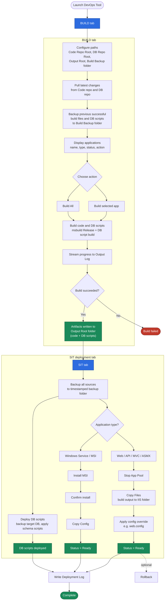

# DevOpsTool - Deployment Flow

Flowchart based on the **BUILD** and **SIT** screens in the Custom DevOps
Deployment Tool (.NET MAUI Blazor Hybrid app).



## BUILD tab

1. **Configure paths** — Set Code Repo Root, DB Repo Root, Output Root, and Build Backup folder.
2. **Pull latest** — Pull latest changes from the Code repo and DB repo.
3. **Build backup** — Back up the previous successful build files and DB scripts to the Build Backup folder.
4. **Applications list** — Shows configured apps with name, type, status, and action.
5. **Choose action** — Build a selected app or **Build All**.
6. **Build code and DB scripts** — Run msbuild (`Configuration=Release`, `DeployOnBuild=true`) and build DB scripts.
7. **Output Log** — Streams build progress and results.
8. **Output** — Code and DB script artifacts written to the Output Root folder.

## SIT deployment tab

1. **Backup** — Back up all sources to a timestamped backup folder.
2. **Deploy code by application type**
   - **Web / API / MVC / ASMX** — Stop App Pool → Copy Files → Apply config override
     → Status Ready (Rollback available).
   - **Windows Service / MSI** — Install MSI → Confirm install → Copy Config →
     Status Ready.
3. **Deploy DB scripts** — Back up the target database and apply schema scripts from the build output.
4. **Deployment Log** — Records backup, code deploy, DB script deploy, and config override activity.

## Editing the diagram

On GitHub, the diagram above renders as a live Mermaid flowchart. To edit it,
change the `mermaid` block in this file (or [`deployment-flow.mmd`](./deployment-flow.mmd),
which should stay in sync). Re-render static exports after edits:

```bash
# PNG
npx -y @mermaid-js/mermaid-cli -i docs/deployment-flow.mmd -o docs/deployment-flow.png -s 2 -b white
# SVG (scalable)
npx -y @mermaid-js/mermaid-cli -i docs/deployment-flow.mmd -o docs/deployment-flow.svg -b white
```
