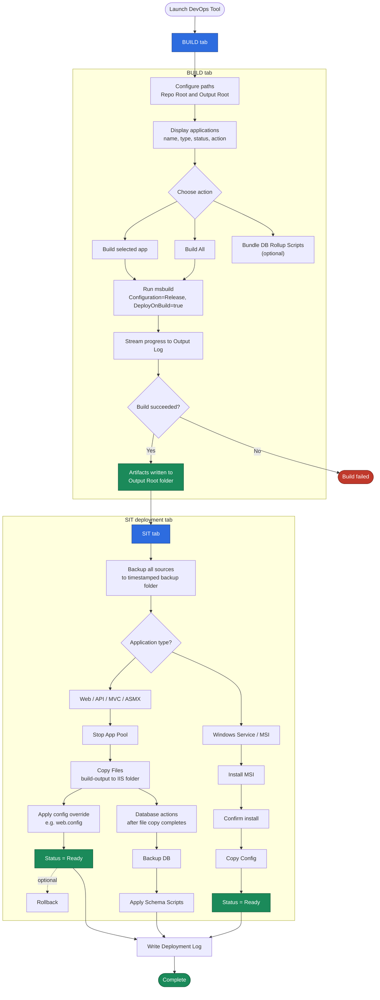

# DevOpsTool - Deployment Flow

Flowchart based on the **BUILD** and **SIT** screens in the Custom DevOps
Deployment Tool (.NET MAUI Blazor Hybrid app).



## BUILD tab

1. **Configure paths** — Set Repo Root and Output Root.
2. **Applications list** — Shows configured apps with name, type, status, and action.
3. **Choose action** — Build a selected app, **Build All**, or optionally **Bundle DB
   Rollup Scripts**.
4. **Run msbuild** — `Configuration=Release`, `DeployOnBuild=true`.
5. **Output Log** — Streams build progress and results.
6. **Output** — Artifacts written to the Output Root folder.

## SIT deployment tab

1. **Backup** — Back up all sources to a timestamped backup folder.
2. **Deploy by application type**
   - **Web / API / MVC / ASMX** — Stop App Pool → Copy Files → Apply config override
     → Status Ready (Rollback available).
   - **Windows Service / MSI** — Install MSI → Confirm install → Copy Config →
     Status Ready.
3. **Database** — After file copy completes: Backup DB → Apply Schema Scripts.
4. **Deployment Log** — Records backup, deploy, and config override activity.

## Editing the diagram

On GitHub, the diagram above renders as a live Mermaid flowchart. To edit it,
change the `mermaid` block in this file (or [`deployment-flow.mmd`](./deployment-flow.mmd),
which should stay in sync). Re-render static exports after edits:

```bash
# PNG
npx -y @mermaid-js/mermaid-cli -i docs/deployment-flow.mmd -o docs/deployment-flow.png -s 2 -b white
# SVG (scalable)
npx -y @mermaid-js/mermaid-cli -i docs/deployment-flow.mmd -o docs/deployment-flow.svg -b white
```
